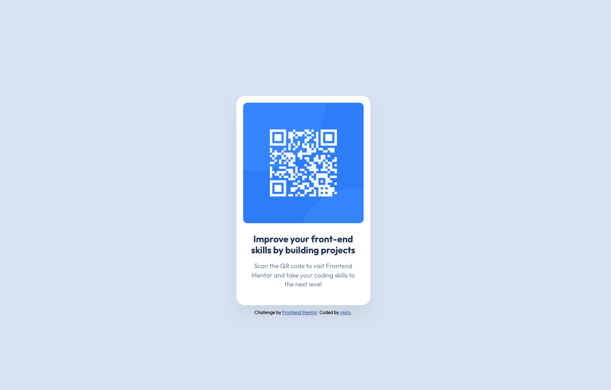
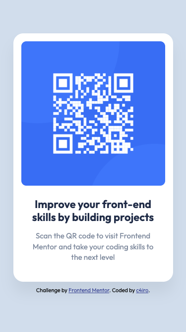

# Frontend Mentor - QR code component solution

This is my solution to the [QR code component challenge on Frontend Mentor](https://www.frontendmentor.io/challenges/qr-code-component-iux_sIO_H). Frontend Mentor challenges help you improve your coding skills by building realistic projects. 

## Table of contents

- [Overview](#overview)
  - [Screenshot](#screenshot)
  - [Links](#links)
- [My process](#my-process)
  - [Built with](#built-with)
  - [What I learned](#what-i-learned)
  - [Continued development](#continued-development)
  - [Useful resources](#useful-resources)
- [Author](#author)

## Overview

### Screenshot

#### Desktop


#### Mobile


### Links

- Solution URL: [https://github.com/c4iro-dev/qr-code-component](https://github.com/c4iro-dev/qr-code-component)
- Live Site URL: [https://c4iro-dev.github.io/qr-code-component/](https://c4iro-dev.github.io/qr-code-component/)

## My process

### Built with

- Semantic HTML5 markup
- CSS custom properties
- Flexbox

### What I learned

This project helped me solidify my understanding of basic HTML and CSS structure. My main focus was on creating a simple, semantic HTML layout and then applying CSS to match the design as closely as possible.

At first, I approached styling element by element, experimenting to see what worked. I quickly realized there was a gap between the visual results I wanted and knowing how to achieve them in code. That led to quite a bit of trial and error — producing redundant or ineffective CSS declarations and a somewhat messy layout early on.

As I iterated, I became more deliberate about understanding how each CSS property and value worked together. This process helped me identify unnecessary code, reduce repetition, and organize my rules more clearly.

My biggest takeaways from this project were:

Gaining a stronger grasp of margin and padding for spacing control.

Learning to fine-tune font-size, font-weight, and line-height for closer design matching.

Improving my CSS organization and naming consistency for clarity and maintainability.

Here are a couple of code examples that I’m proud of:

```html
<!-- A simple, semantic HTML structure for the QR card -->
  <main>
    <div class="container">
      <div class="q-container">
        
        <h2>Improve your front-end skills by building projects</h2>
        <p>Scan the QR code to visit Frontend Mentor and take your coding skills to the next level</p>
      </div>
    </div>
  </main>
```
```css
/* Clean, scoped CSS for better organization */
.q-container {
    margin: 0 auto;
    text-align: center;
}

.q-container img {
    display: block;
    border-radius: 10px;
    max-width: 100%;
    width: 100%;
    margin: 0 auto;
}

.q-container h2 {
    width: 90%;   
    color: var(--clr-slate-900);   
    font-size: 1.37rem;
    font-weight: 650; 
    line-height: 1.2;
    margin: 24px auto 0;
}

.q-container p {
    width: 90%;   
    color: var(--clr-slate-500);
    font-weight: 380;
    font-size: 15.2px;
    line-height: 1.4;
    margin: 14px auto 23px;
}
```

Overall, this was a great exercise in turning experimentation into structured understanding.

### Continued development

Going forward, I want to keep focusing on the fundamentals and improving my workflow. In particular, I plan to:

* Continue writing clean, semantic HTML with a clear and logical structure.

* Strengthen my understanding of CSS properties and how they work together to control layout, spacing, and typography.

* Write complete, detailed README.md files to document my process and reflect on what I learn in each project.

* Practice refining my code over time to more closely match the provided design and style guide specifications.

My main goal is to build stronger habits around writing maintainable code and developing a deeper intuition for how CSS affects layout and presentation.

### Useful resources

- [Frontend Mentor Starter Files](https://www.frontendmentor.io/) – Provided the HTML/CSS starter code and design files.
- [ChatGPT](https://chatgpt.com/) – Assisted with understanding CSS properties, layout, spacing, and best practices throughout this project.

## Author

- Frontend Mentor - [@c4iro-dev](https://www.frontendmentor.io/profile/c4iro-dev)
- GitHub - [c4iro-dev](https://github.com/c4iro-dev)